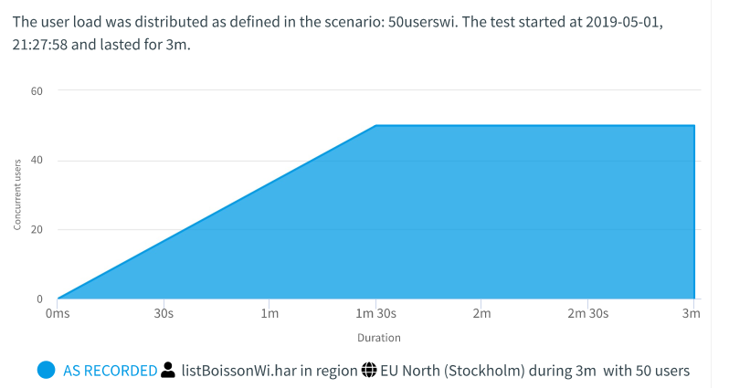
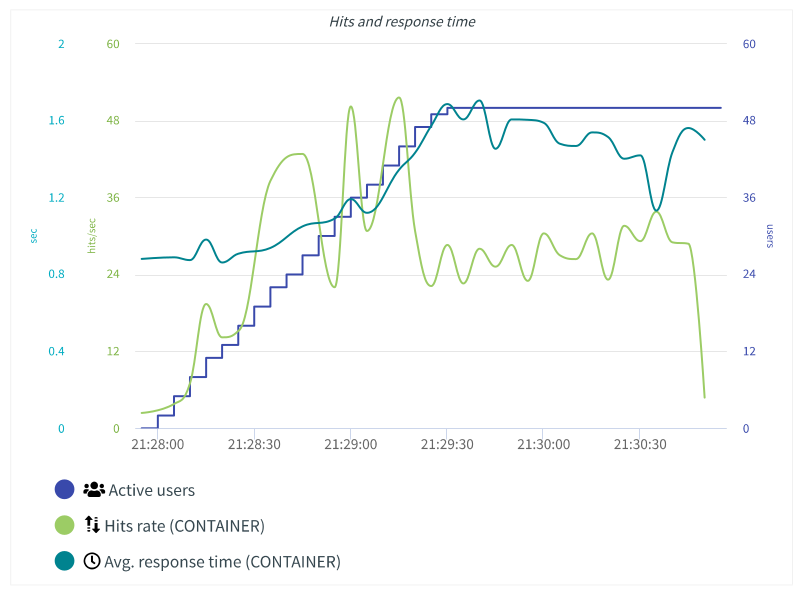

\newpage

\tableofcontents

\newpage

# Rapport de tests

Ce document présente les résultats des différents tests effectués.

## Tests unitaires

Les tests unitaires sont exécutés lors du build Jenkins. Tous les tests unitaires doivent fonctionner pour l'application. Des tests unitaires ont été implémentés pour tous les controlleurs et les méthodes importantes ont été testées.

## Tests de qualités

Les tests de qualités sont passés avec un code coverage de 66% et les code smells restant sont des todo qui n'ont pas pu être implémenté. Il reste des failles de sécurité POJO, mais comme discuté en 

## Tests de performance

Les tests de performance ont bien été exécutés avec un temps de réponse moyen de 1.28 s, ce qui passe largement l'objectif que nous nous étions fixé. Le test a été effectué durant 3 minutes et avec 50 utilisateurs (Maximum possible avec un compte gratuit Octoperf).

{ width=70% }

Il y a eu 2 erreurs pendant le test où le serveur n'a pas répondu, mais nous pensons que c'est dû à l'infrastructure réseau. Nous avons mené le test en ouvrant les ports du routeur Swisscom, le firewall domestique et le firewall Windows.

Le temps de réponse a été stable durant la durée totale du test. Ce temps a bien entendu légèrement augmenté durant le ramp-up, mais le temps de réponse maximum atteint était 1.6s.

{ width=70% }

La plupart du trafic généré a été du code CSS et JavaScript. C'est principalement dû au fait que nous utilisons Bootstrap et jQuery. Afin d'améliorer le résultat du test de performance, on pourrait très bien se passer de jQuery et la modification du code ne serait très peu couteuse en temps.

{ width=70% }

Pour conclure, les résultats obtenus par le test de performance sont très satisfaisants et offrent quelques pistes d'améliorations.

# Conclusion

En conclusion, les tests unitaires ont tous été validés lors du build de l'application. Le test de qualité est plus que satisfaisant et les problèmes principaux notifiés par ce test ont été corrigés. Les éléments restants sont des améliorations non cruciales pour le fonctionnement de l'application. Quant au test de performance, il correspond aux attentes que nous nous étions fixées.