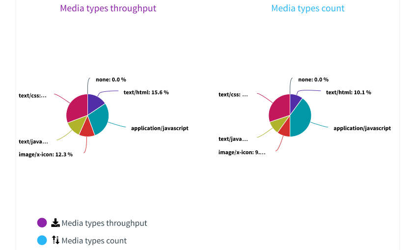

\newpage

\tableofcontents

\newpage

# Rapport de tests

Ce document va expliquer le résultat des tests et les résultats obtenus.

## Tests unitaires

Les testes unitaires sont exécutés lors du build Jenkins. Tous les tests unitaires doivent fonctionner pour l'application. Des tests unitaires ont été implémentés pour tous les controlleurs et les méthodes sont toutes testées également.

## Tests de qualités

Les tests des qualités sont passé avec un code coverage de 61% et les code smells restant sont des todo qui n'ont pas pu être implémenté. Il reste des failles de sécurité POJO, mais comme discuté en 

## Tests de performance
 
Les tests de performance ont bien été exécuté avec un temps de réponse moyen de 1.28 s, ce qui passe largement l'objectif que nous nous étions fixé. Le test a été fait pendant 3 minutes et avec 50 utilisateurs (Maximum possible avec un compte gratuit Octoperf).

{ width=70% }

Il y a eu 2 erreurs pendant le tests où le serveur n'a pas répondu, mais nous pensons que c'est dû à l'infrastucture réseau. Nous avons mené le test en ouvrant les ports du routeurs Swisscom, le firewall domestique et le firewall windows.

Le temps de réponse a été stable pendant tout le test. Évidemment, ça a un peu augmenté après le ramp-up, mais le temps de réponse maximum atteint était 1.6s.

{ width=70% }

La plupart du trafic généré a été du code CSS et Javascript. C'est principalement dû au fait que nous utilisons Bootstrap et jQuery. Afin d'améliorer le résultat du test de performance on pourrait très bien se passer de jQuery et la modification du code ne serait très peu couteuse en temps.

{ width=70% }

Pour conclure, les résultats obtenus par le test de performance sont très satisfaisait mais améliorable.

# Conclusion

En conclusion, les tests unitaires ont tous été validés lors du build de l'application. Le test de qualité sont satisfaisant, les gros problèmes notifié par ce test ont été corrigés et les éléments restants sont des améliorations non crucial pour le fonctionnement de l'application. Quand au test de performance il correspond aux attentes que nous nous étions fixés.