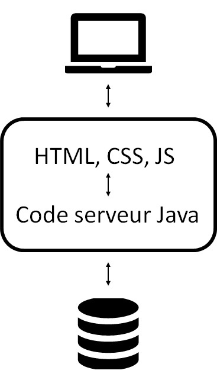

\newpage

\tableofcontents

\newpage

# Introduction

Pour le cours de J2EE nous avons réalisé une application avec l'aide de Spring Boot. Le but de ce projet est de créer un site communautaire où les utilisateurs uploadent des images et vote pour les meilleures images. La partie test du projet à été faite en parralèlle avec le cours de Qualité Logiciel.

# Réalisation 

## Bibliothèques

Nous n'avons pas utilisé de bibliothèque en plus de Spring pour le côté Backend et nous avons utilisé Bootstrap et jQuery pour ce qui est frontend.

## Repository git

Pour des fins organisationelles, nous avons travaillé avec Git. Voici le lien du repository

- [https://github.com/bull0n/springwater](https://github.com/bull0n/springwater) 

## Architecture du code

Nous avons essayé de grouper les classes par fonctionnement dans le projet. Par exemple, nous avons groupé les controlleurs dans un package.

L'architecture finale du projet est telle :

- config
- controllers
- exceptions
- models
      - entities  
      - repository
- security
- service
      - impl

## Architecture

{ width=30% }

L'architecture choisie pour ce projet est le monolithe car c'est la solution qui nous semblait la plus adéquate. En effet, c'est un petit projet et c'est la solution la plus simple à mettre en place.

Voici les différentes parties de l'architecture de haut en bas:

1. L'ordinateur rerpésente le client qui se connecte à notre application.
1. Le bloc du milieu représente le monolithe comportant la partie frontend et backend.
1. Le dernier bloc représente la base de données afin de persister les données.

## Etat du projet

Le projet a été réalisé en Spring. Toutes les fonctionnalités du cahier des charges ont été remplies, mais quelques bugs ont été trouvé lors du test de l'application.

### Bugs connus restant

Cette partie du document présente les bugs connus restant dans l'application

#### Images

Actuellement, lorsqu'on upload une image, elle n'est pas renommé. Ce qui fait qu'on ne peut pas avoir 2 images avec le même nom.

#### Modification d'une boisson

Lorsqu'on modifie une boisson on doit réuploadé l'image sinon elle sera ecrasée.

### Améliorations

La première amélioration ergonomique serait de connecté l'utilisateur après son inscription. Pour le moment, quand un utilisateur crée un compte il reste sur le formulaire d'inscription, ce qui n'est pas intuitif du tout.

# Conclusion

